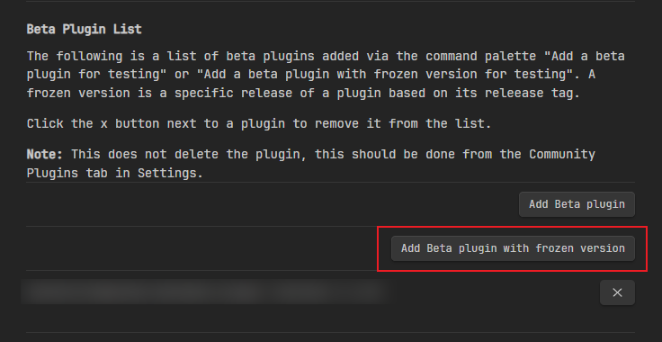

# obsidian-local-images-releases

Obsidian下载图片至本地插件的魔改版本

## 魔改版本的特性

魔改版本增加了以下特性：

- 可根据文档所属目录存放下载图片，需要开启`Path is based on the MD file`设置，具体可查看原组件[PR47](https://github.com/aleksey-rezvov/obsidian-local-images/pull/47)。
- 下载的图片将使用图像数据MD5后作为图片名称
- 下载图片存放地址支持按文件名命名目录存放。在`Media folder`设置中填上`assets/${fileBaseName}`，就能看到效果。

## 安装

先安装 [Obsidian42](https://github.com/TfTHacker/obsidian42-brat) 这个插件。用来支持安装来自Github仓库的插件。

然后点击下面按钮：

输入如下内容：

- `Repository`：lpreterite/obsidian-local-images-releases
- `Version`：0.14.3

> 需要注意：原版存在的记得将其**禁用**

接下来，去**第三方插件**找到 obsidian-local-images 启用就可以了。

## 使用

使用细节和原版大致相同，可参考原版[README](https://github.com/aleksey-rezvov/obsidian-local-images)
